<p align="center">
  
</p>

<p align="center">
  <a href="https://ms9.co.jp/"></a>
  <a href="https://github.com/hisaomasaki"></a>
</p>

---

### 🧑‍💻 About Me

<p>
  
  
  
</p>

```yaml
name: Hisao Masaki (柾木 久央)
role: CEO & CTO @ MS9 Inc.
location: Japan 🇯🇵
education:
  - Kyoto University (Sociology/Linguistics)
  - University of Oxford (Study Abroad)
languages:
  - Japanese: Native
  - English: TOEIC 985
current_focus:
  - AI-Native Product Development
  - Business Automation Agents
  - Healthcare Tech (YULIER)
```

---

### ⚡ Currently Building (2026)

<table>
<tr>
<td width="50%" valign="top">

**🎬 Article Assistant V3**

> AI×動画×コンテンツ制作プラットフォーム

- React / TypeScript / Python
- Fish Audio (Lip-sync AI)
- Character Animation Pipeline

</td>
<td width="50%" valign="top">

**🤖 Automation Agents**

> バックオフィス業務の完全自動化

- Gemini API / PDF Analysis
- GitHub Actions Workflows

</td>
</tr>
</table>

---

## 🛠️ Tech Stack

<p align="center">
  
</p>
<p align="center">
  
</p>

<p align="center">
  
</p>
<p align="center">
  
</p>

<p align="center">
  
</p>
<p align="center">
  
</p>

---

## 📊 GitHub Activity

<p align="center">
  
</p>

---

## 🚀 Projects & Business

<table>
<tr>
<td width="50%" valign="top" align="center">

### 🏢 MS9 Inc.

**エムズナイン株式会社**

ヘルスケア・教育・コンサルティング
複数事業を展開


<a href="https://ms9.co.jp/">
  
</a>

</td>
<td width="50%" valign="top" align="center">

### 🏥 YULIER

**訪問看護ステーション**

身体とメンタルの両面をケアする訪問看護
IT × 温かみのある在宅ケア


<a href="https://yulier.care/">
  
</a>

</td>
</tr>
</table>

---

## 📚 Career & Background

<p>
  
</p>

<details>
<summary>📋 経歴テーブルを見る / View Career Table</summary>

| Period     | Role               | Organization          |
| ---------- | ------------------ | --------------------- |
| 2021 - Now | **CEO & CTO**      | エムズナイン株式会社 (MS9 Inc.) |
| 2024 - Now | **Founder**        | YULIER 訪問看護ステーション     |
| Previous   | Corporate Planning | XYMAX Corporation     |
| Previous   | English Teacher    | High School (3 years) |
| Previous   | COO                | Apparel Startup       |

</details>

---

## 📜 Certifications

<p>
  
  
  
  
</p>

---

## 🎯 Personality & Values

<table>
<tr>
<td width="50%" valign="top">

**MBTI**: ESFJ-A (Consul) - Visionary Leader

**StrengthsFinder**:


</td>
<td width="50%" valign="top">

**Core Values**:
- 「影響の輪に集中する」
- 「どうすればできるかを考える」
- 「結果にこだわる」

**Hobbies**: Sauna / Travel / Starbucks (300+ stores) / Snowboarding / Piano

</td>
</tr>
</table>

---

<details>
<summary>📝 経歴の詳細 / Detailed Career History</summary>

#### 個人事業主時代 / Freelance Period

- **2017年**: 個人事業主として開業（ゲストハウス経営）
- **2018年**: ウェブ・テクノロジー分野に参画

#### 企業勤務 / Corporate Experience

- 高校で英語講師を3年間経験
- 株式会社ザイマックスに中途入社し、経営企画部にて他店舗事業、海外事業、関西事業などを担当
- 友人の事業（アパレルステッカー、アクリルグッズEC）に取締役COOとして参画

#### エムズナイン株式会社設立後 / After Founding MS9 Inc.

- **2021年**: エムズナイン株式会社を設立、代表取締役就任
- **2024年**: 訪問看護ステーション「YULIER」開設

### 主な経験領域 / Main Experience Areas

経営企画、事業開発、プロジェクトマネジメント、マーケティング（デジタル、Web制作、SNS、広告運用）、組織構築、採用、資金調達、財務経理、法人営業、教育、不動産アセットマネジメント、訪問看護事業運営

</details>

---

## 📬 Let's Connect

<p align="center">
  <b>ビジネス・技術・協業のご相談はお気軽に</b><br/>
  Open to business opportunities, tech discussions, and collaborations.
</p>

<p align="center">
  <a href="https://ms9.co.jp/"></a>
  <a href="https://github.com/hisaomasaki"></a>
</p>

<p align="center">
  
</p>
